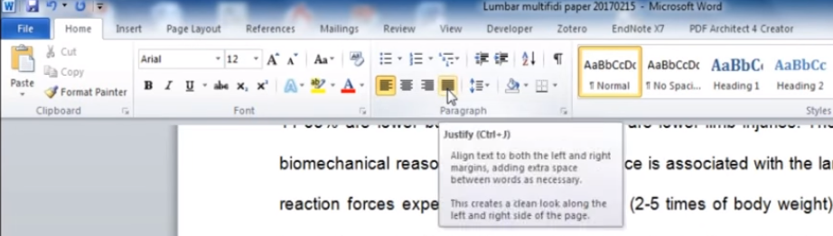

# CSS入门分享
+ 分3部分
+ css基础语法规则
+ css cascading层级覆盖
+ css layout（主要讲flex layout）


## css基础语法规则
+ 
```
style-rule ::=
    selectors-list {
      properties-list
    }
```
+ 常用的selector有`* p .classname #idname`
+ 比如这段 `p{font-size:20px;}`
+ [property和attribute的区别](./property-vs-attribute.md)

### css selector语法体验
+ 空格和逗号的区别：空格表示descendant，逗号是separator并列。
+ 记不住？只需要记住csv，comma separated value。这里是comma separated selectors
+ [./lab-selector.html](./lab-selector.html)
+ 体验1 参考答案（选中后可见）
<pre style="color:white;background:white">

.box0 .div0{color:red}
.box0 .div1{color:blue}
.box0 div{color:green;}

.box0>.div0{color:red}
.box0>.div1{color:blue}
.box0>div{color:green;}
 > 是direct child combinator（直接下级），实践中比较少用。

.box0 div:nth-child(2){color:red}
.box0 div:nth-child(3){color:blue}
.box0 div{color:green}
</pre>
 
+ 体验2 参考答案（选中后可见）
<pre style="color:white;background:white">
.p0,.p2,.p4{background:gray}
.p1,.p3,.p5{background:white}

.box1 p:nth-child(2n){background:gray}
.box1 p:nth-child(2n+1){background:white}

.box1 p{background:white}
.box1 p:nth-child(even){background:gray}
</pre>
> nth-child实际是count start 1，可以尝试把pre注释掉试一下。


## css cascading层级覆盖
+ [cascading.html](./cascading.html)

## css layout
+ 默认的布局是flow layout。block元素占满宽度，inline元素仅占据自身宽度。
+ block formatting context （BFC）。block可以嵌套，比如两级absolute定位。
+ 最常用的3个position值 `position: static; position: relative; position: absolute;`
+ 案例解析：[absolute.html](./absolute.html)

> 扩展阅读:
> + https://developer.mozilla.org/en-US/docs/Web/CSS/CSS_Flow_Layout/Block_and_Inline_Layout_in_Normal_Flow 
> + https://developer.mozilla.org/en-US/docs/Web/Guide/CSS/Block_formatting_context


### flex布局
+ flex是css3的规范，最早是2013年chrome 29中支持的。2015年ios9中也支持了。目前已经是标准功能了，不用考虑兼容性。
+ 在规范中定义了11个properties：`align-content align-items align-self flex flex-basis flex-direction flex-flow flex-grow flex-shrink flex-wrap justify-content`
+ 难点是：属性太多、可选值太多，记不住。
+ 最常用的：`display:flex; flex-direction:row; flex:1;`
+ `flex:1`是缩写，约等于`flex-grow:1`，占满剩余主轴空间。
+ 核心概念， flex中有两个轴（axes），main axis、cross axis（交轴）。通过flex-direction指定。
+ 最难区分：`align-items justify-content`。中文翻译都叫对齐。记住justify就是word上的两端对齐，控制**主轴**上的摆放方式。
+ 

> tips:
> 
> + axis 轴、轴线，复数是axes
> + axe 斧子，复数是axes。axes既是斧子又是轴线。

+ 练习题: [lab-flex.html](./lab-flex.html)
+ 答案： [lab-flex-answer.html](./lab-flex-answer.html)


## css发展趋势
+ css variables，chrome已经支持
+ less/sass，预处理，支持嵌套和变量
+ module css，需要在webpack中使用，每个class都自动创建uniq prefix
+ styled-component，react生态中最流行的css-in-js解决方案，示例如下：
 
```
const StyledDiv = styled.div`
  color:red;
`
return <StyledDiv>Hello</StyledDiv>;
```


## 扩展阅读
+ MDN `https://developer.mozilla.org/en-US/docs/Web/CSS`
