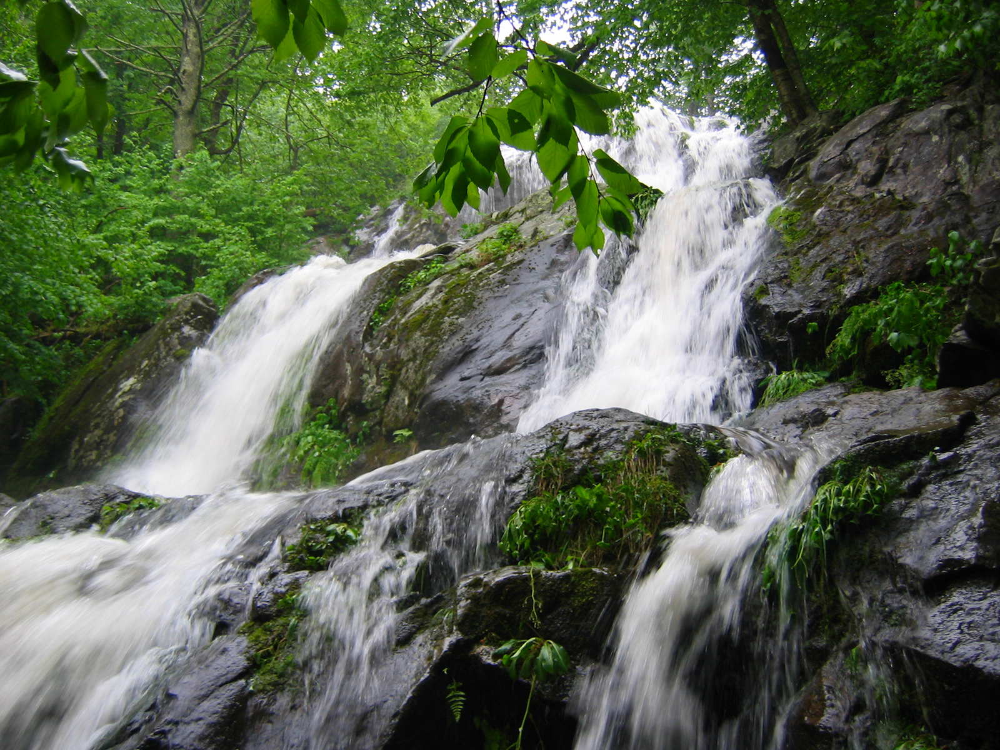
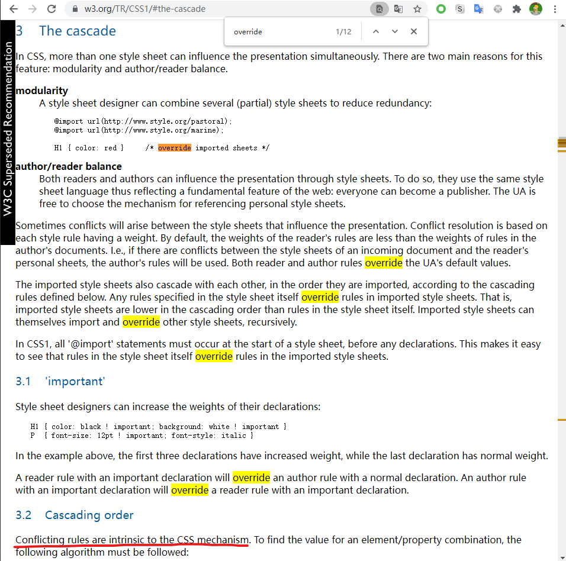
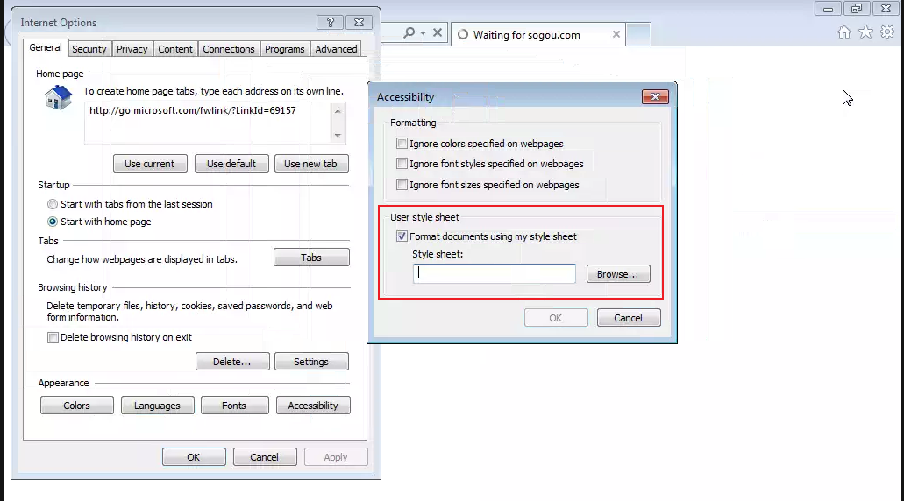

## css是什么
+ css Cascading Style Sheets 层叠样式表，用于给html网页添加样式。
+ "cascade"，到底是什么意思？它的本意是多层级的瀑布，水流经多个坡。一说到瀑布大家想到的一般是90度下落，那是悬崖瀑布。实际瀑布分很多种。

> 各种瀑布类型： https://en.wikipedia.org/wiki/List_of_waterfalls_by_type#Cascade
> cascade瀑布：https://www.britannica.com/science/cascade-waterfall

+ 在网页中，cascade指的是，规则可以**覆盖**，高优先级的规则可以覆盖低优先级。就像 cascade瀑布（勉强叫层叠瀑布），高处的水可以覆盖低处的水。
+ css中最复杂的也是冲突、覆盖。在css1规范中有这句话：`Conflicting rules are intrinsic to the CSS mechanism.` 冲突的规则是内置于css机制的。
+ css很重要的一部分就是：解决冲突（通过建立优先级，css中叫specificity）。这部分也是css中最麻烦的。
  

### user css vs author css
+ user很少指定css，但所有browser都支持user手动指定css。
+ ie中支持指定user style sheet
+ 
+ chrome中可以自定义字体（也相当于user css）。用stylish插件也可以覆盖css。

> 分享一个最简单的stylish样式，给h1-h6添加边框
> h1 { border:3px solid red !important;}
> h2 { border:3px solid green !important;}
> h3 { border:3px solid blue !important;}
> h4 { border:1px solid red !important;}
> h5 { border:1px solid green !important;}
> h6 { border:1px solid blue !important;}

+ 从作者的角度来看，希望在所有浏览器上显示的UI都一样，所以项目实践上经常上会先引入一份normalize.css（`https://www.npmjs.com/package/normalize.css`），不过随着chrome占领市场，normalize用的越来越少了。
+ 再次体现，cascade级联覆盖的特征，用户可以覆盖网页样式，网页又可以覆盖用户样式。

## css覆盖简单体验
+ [lab-override](./lab-override.html)

    
test1 解决方法

    <pre>
    添加class，如.a0{color:blue;}
    inline-style style="color:blue"
    添加一个 a{color:blue !important;}
    添加一个id，然后用id selector #a0{border-radius: 0;} 
    </pre>

    
test2 解决方法

    <pre>
    div.container0{border-radius:0}
    inline-style style="border-radius:0"
    .container0{border-radius: 0 !important}
    </pre>

